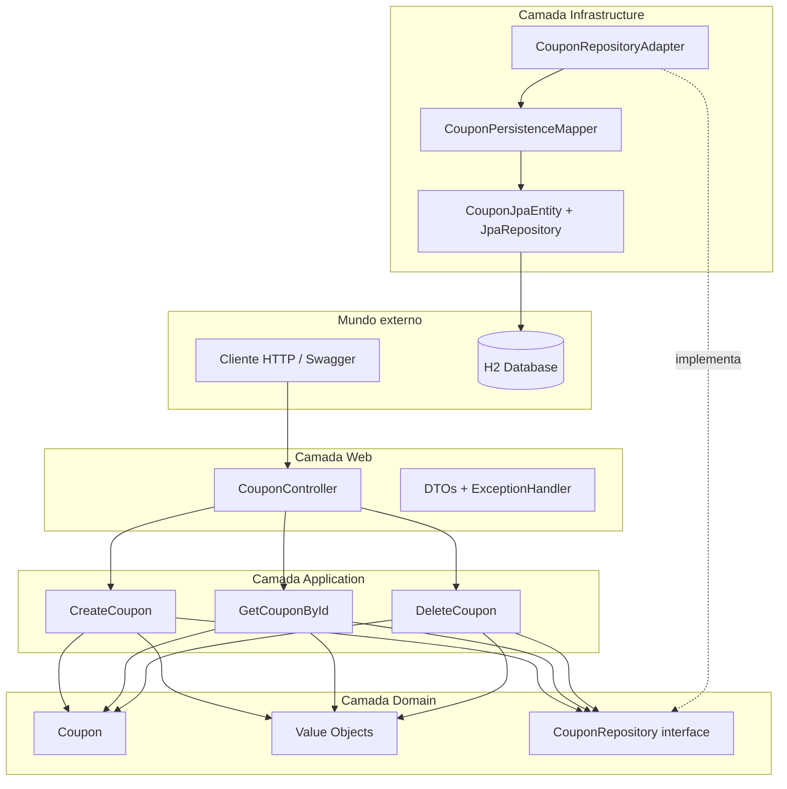
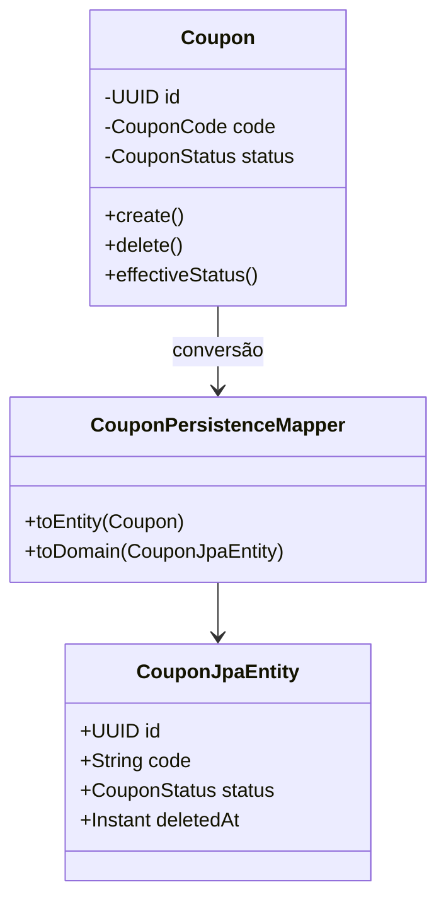
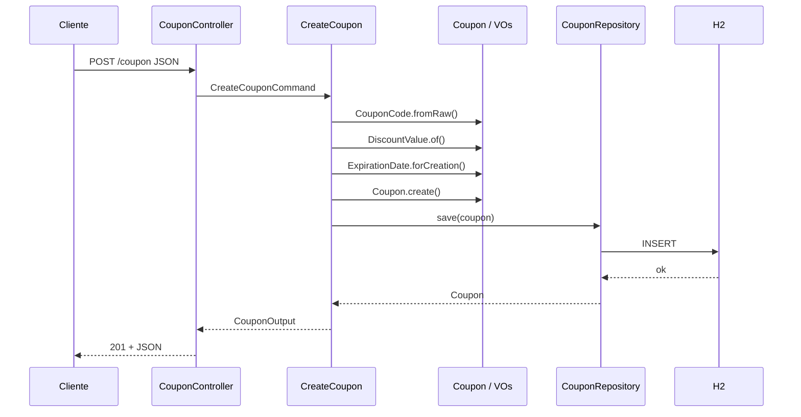
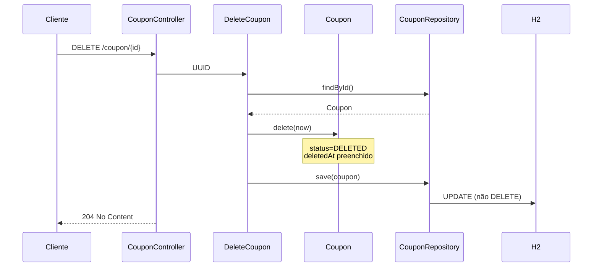
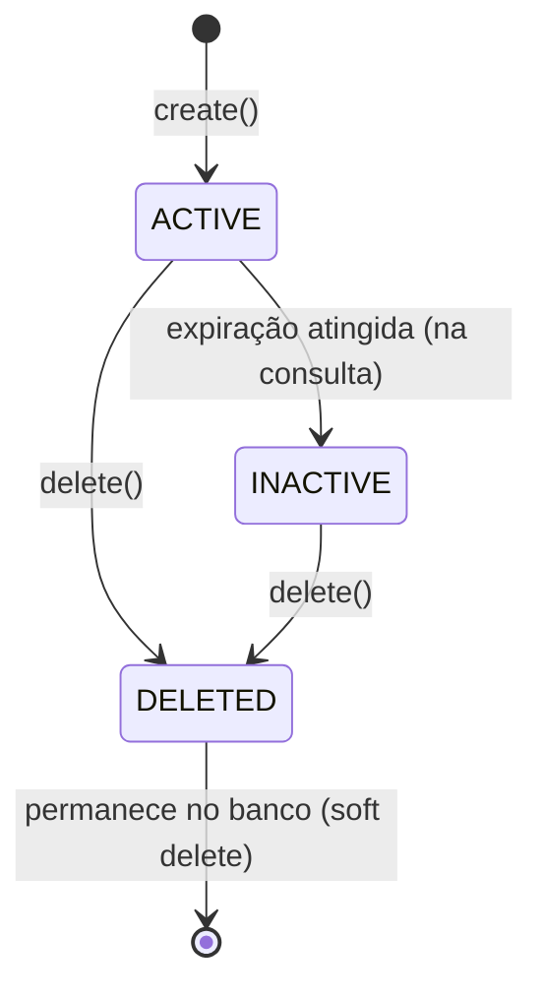
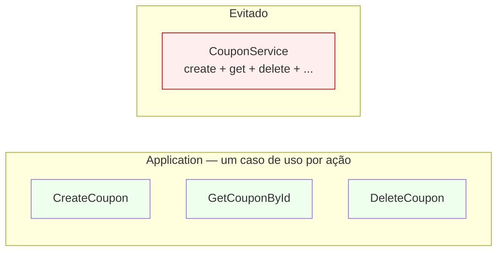
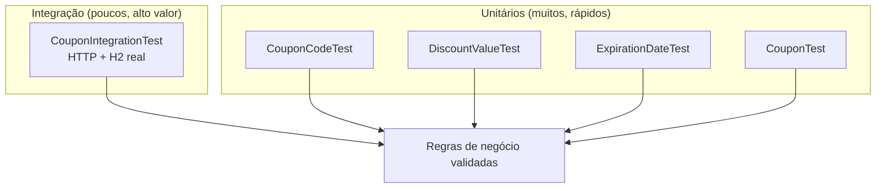
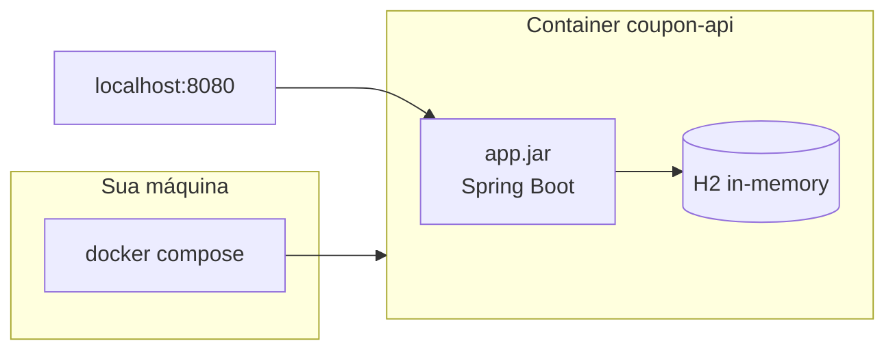

# Arquitetura — Coupon API

Documento visual e conceitual da arquitetura do projeto.

---

## 1. Estilo arquitetural

**Clean Architecture** + princípios de **Arquitetura Hexagonal** (Ports & Adapters).



---

## 2. Regra de dependência

As setas de código **sempre apontam para dentro** (em direção ao domínio):

| Camada | Pode depender de |
|--------|------------------|
| Domain | Nada externo (só Java puro) |
| Application | Domain |
| Infrastructure | Domain + frameworks |
| Web | Application + Domain (DTOs) |

O domínio **nunca** importa `org.springframework` nem `jakarta.persistence`.

---

## 3. Domínio vs persistência



| Objeto | Papel |
|--------|-------|
| `Coupon` | Regras e comportamento |
| `CouponJpaEntity` | Formato da tabela |
| `CouponPersistenceMapper` | Tradutor entre os dois |

---

## 4. Fluxo — criar cupom



---

## 5. Fluxo — soft delete



---

## 6. Status do cupom (`ACTIVE` / `INACTIVE` / `DELETED`)



- **ACTIVE:** cupom válido e não expirado
- **INACTIVE:** calculado na resposta quando `expirationDate` já passou (método `effectiveStatus`)
- **DELETED:** após soft delete (persistido no banco)

---

## 7. Casos de uso (intenção única)



---

## 8. Testes — pirâmide



---

## 9. Deploy local com Docker



---

## 10. Pacotes (mapa mental)

```
com.couponapi
├── domain          ← coração (regras)
├── application     ← orquestra
├── infrastructure  ← JPA, adapters
└── web             ← HTTP
```

---

Ver também: [README.md](README.md) | [ENTREGA.md](ENTREGA.md)
